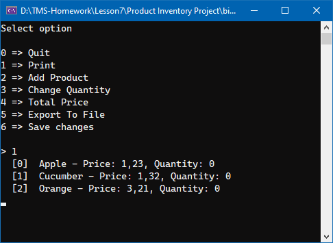

### 7. Классы в .Net

Product Inventory Project - создайте приложение, которое управляет инвентаризацией продуктов:
- Создайте класс продукта, в котором есть цена, идентификатор и количество.
- Затем создайте класс инвентаря, который отслеживает различные продукты и может суммировать стоимость инвентаря.

Добавить конфигурацию и меню

