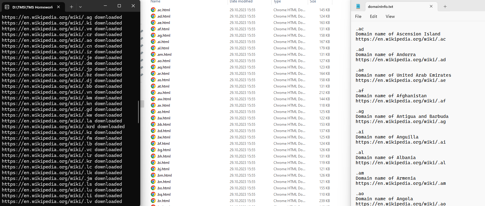

### 9. Работа с интернетом и сетью

*DomainsInfo* 

- Retrieves list of country domains names and links to dedicated articles from [Country code top-level domain](https://en.wikipedia.org/wiki/Country_code_top-level_domain) (Wikipedia).
- Saves them to domainsInfo.txt.
- Downloads HTML content of each article page replacing all `src` and `href` attributes values with absolute URL.

